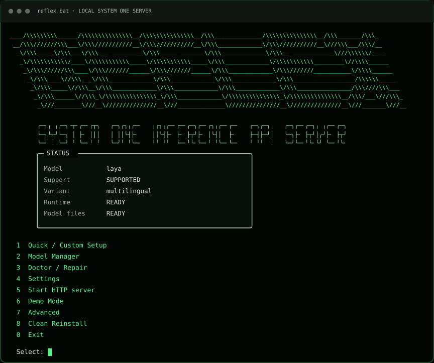

<p align="center"></p>

<p align="center">
  
  
  
  
  <br>
  
  
  
  
</p>

**Reflex System One runs specialized decision models locally through a simple server API.** It gives applications a fast way to make structured decisions from the context you provide, whether that means choosing between several options, estimating the probability of a yes or no outcome, or assigning a score across an ordered range. Everything runs locally and returns compact, predictable results that are easy to use from other applications.

Reflex is Windows-first and self-contained. It installs its own portable Python runtime, manages model-specific environments and pinned checkpoints, and exposes local inference through the System One HTTP API or an interactive Demo Mode. No preinstalled Python environment is required.

<p align="center">
  
</p>

## Highlights

- **One-click local setup** - start with `reflex.bat`, run `1. Quick Setup`, and `5. Start HTTP Server API`.
- **Curated decision models** - choose from a small set of tested models ready to run locally.
- **Native Windows execution** - CPU and NVIDIA CUDA paths are managed per backend family.
- **Compact System One API** - `POST /v1/systemone`, `GET /v1/models`, and `GET /health`.
- **Direct Demo Mode** - test requests in the console without starting FastAPI, Uvicorn, or a TCP listener.
- **Model Manager** - download, verify, repair, remove, re-download, and select supported models.
- **Doctor / Repair** - inspect runtime, environment, model, GPU, configuration, and server prerequisites.
- **Local and privacy-conscious** - inference runs on your machine, request and decision content is excluded from normal logs.
- **Reliable local setup** - pinned runtimes, dependencies, and model versions keep installations consistent.

## Requirements

- **Windows 10 or Windows 11 x64**
- **No preinstalled Python required**
- **No system-wide CUDA Toolkit required**
- **Internet connection for initial runtime and model downloads**
- **NVIDIA GPU optional** for Laya and Decider, and required for Sol and Nox
- Enough free disk space and RAM/VRAM for the model you select

Reflex downloads model weights locally. Model sizes range from well under 1 GiB to multiple GiB, so check the model table below before choosing a checkpoint.

## Quick start

Clone the repository on Windows:

```powershell
git clone https://github.com/JRodrigoTech/reflex-system-one.git
cd reflex-system-one
.\reflex.bat
```

On first use, choose **Quick / Custom Setup**. Reflex can bootstrap the portable runtime, prepare the required backend environment, and download the selected model. Downloads can also be postponed and managed later through **Model Manager**.

Start the server from the wizard. By default it listens only on:

```text
http://127.0.0.1:1919
```

With the server running, try a request from PowerShell:

```powershell
$body = @{
    model = "reflex"
    state = @{
        message = "The customer was charged twice."
    }
    questions = @{
        department = @{
            type = "choice"
            instructions = "Select the correct department."
            criteria = @{
                billing = "Payments, invoices, refunds and charges"
                support = "Technical product problems"
            }
        }
    }
} | ConvertTo-Json -Depth 6

Invoke-RestMethod `
    -Method Post `
    -Uri "http://127.0.0.1:1919/v1/systemone" `
    -ContentType "application/json" `
    -Body $body
```

The response contains the active model, typed answers, probabilities where applicable, and usage metadata.

## Supported models

<table>
  <thead>
    <tr>
      <th>Reflex ID</th>
      <th>Upstream model</th>
      <th>Devices</th>
      <th>Variant</th>
      <th>Approx. checkpoint / observed VRAM</th>
      <th>State</th>
    </tr>
  </thead>
  <tbody>
    <tr>
      <td rowspan="3"><code>laya</code></td>
      <td rowspan="3">
        <a href="https://huggingface.co/convaiinnovations/laya">
          convaiinnovations/laya
        </a>
      </td>
      <td rowspan="3">CPU / CUDA</td>
      <td>multilingual</td>
      <td>~0.60 GiB file / ~1.52 GiB VRAM</td>
      <td rowspan="3"><strong>Supported</strong></td>
    </tr>
    <tr>
      <td>english</td>
      <td>~0.79 GiB file / ~2.50 GiB VRAM</td>
    </tr>
    <tr>
      <td>typed-decisions</td>
      <td>~0.78 GiB file / ~2.50 GiB VRAM</td>
    </tr>
    <tr>
      <td><code>decider-2b</code></td>
      <td>
        <a href="https://huggingface.co/Mapika/decider-2b">
          Mapika/decider-2b
        </a>
      </td>
      <td>CPU / CUDA</td>
      <td colspan="2">~3.51 GiB file / ~3.79 GiB VRAM</td>
      <td><strong>Supported</strong></td>
    </tr>
    <tr>
      <td><code>decider-4b</code></td>
      <td>
        <a href="https://huggingface.co/Mapika/decider-4b">
          Mapika/decider-4b
        </a>
      </td>
      <td>CPU / CUDA</td>
      <td colspan="2">~7.83 GiB file / ~8.44 GiB VRAM</td>
      <td><strong>Supported</strong></td>
    </tr>
    <tr>
      <td><code>sol-2b</code></td>
      <td>
        <a href="https://huggingface.co/llm-semantic-router/Decision-1.0-Sol-2B">
          .../Decision-1.0-Sol-2B
        </a>
      </td>
      <td>CUDA</td>
      <td colspan="2">~3.60 GiB VRAM</td>
      <td><strong>Supported</strong></td>
    </tr>
    <tr>
      <td><code>nox-4b</code></td>
      <td>
        <a href="https://huggingface.co/llm-semantic-router/Decision-1.0-Nox-4B">
          .../Decision-1.0-Nox-4B
        </a>
      </td>
      <td>CUDA</td>
      <td colspan="2">~8.00 GiB VRAM</td>
      <td><strong>Supported</strong></td>
    </tr>
    <tr>
      <td><code>lux-9b</code></td>
      <td>
        <a href="https://huggingface.co/llm-semantic-router/Decision-1.0-Lux-9B">
          .../Decision-1.0-Lux-9B
        </a>
      </td>
      <td>CUDA</td>
      <td colspan="2">~14.82 GiB BF16 weights</td>
      <td><strong>Experimental</strong></td>
    </tr>
  </tbody>
</table>

The VRAM figures above are observations from pinned qualification runs, not universal minimums or hard caps.

Laya uses `multilingual` as its default checkpoint variant. You can install and select other variants, such as `english` and `typed-decisions`, through the Model Manager.

For Sol 2B and Nox 4B, Reflex checks for a compatible NVIDIA CUDA device, compute capability 8.6+, BF16 support, and sufficient free VRAM before loading. Lux remains experimental and is not available for normal activation until full model qualification is completed.

One server process loads one active checkpoint at a time.

## API

Reflex exposes a typed-decision interface rather than a general text-generation API.

### `POST /v1/systemone`

```json
{
  "model": "reflex",
  "state": {
    "message": "The customer was charged twice."
  },
  "questions": {
    "department": {
      "type": "choice",
      "instructions": "Select the correct department.",
      "criteria": {
        "billing": "Payments, invoices, refunds and charges",
        "support": "Technical product problems"
      }
    },
    "urgent": {
      "type": "noul",
      "instructions": "Does this require urgent handling?"
    }
  }
}
```

Reflex normalizes backend output into one response contract. The three supported System One primitives are:

| Type | Description |
|---|---|
| `choice` | Choose among named alternatives and return their probabilities. |
| `noul` | Return a binary yes/no probability. |
| `score` | Return a probability-weighted position on an ordered scale. |

### Other endpoints

```http
GET /v1/models
GET /health
```

`/v1/models` reports the identifiers accepted by the running process. `/health` reports non-content operational state and remains separate from model inference. The aliases `reflex` and `jev-latest` resolve to the active model. Requests cannot select arbitrary local model.

## Demo Mode

Demo Mode calls the same decision service as the HTTP server but does **not** start FastAPI, Uvicorn, or a TCP listener.

Select **Demo Mode** from the wizard and paste a one-line System One request:

```text
> {"model":"reflex","state":"...","questions":{...}}
{"model":"laya","answers":{...},"usage":{...}}
```

The active model remains loaded for repeated requests. Type `EXIT` to return to the wizard.

## Security & privacy

Reflex is designed for **local inference**. The default server binds to `127.0.0.1`, request and decision content is excluded from normal logs.

If you change the bind address or expose Reflex to another device or network, you are responsible for securing that deployment. Reflex requires Bearer authentication for non-loopback binding, but you should still configure appropriate firewall rules, access controls, reverse-proxy/TLS settings where needed, and avoid exposing the API directly to the public Internet.

## Command line

The wizard is the normal entry point, but the installed core runtime also exposes direct commands:

```powershell
runtime\envs\core\Scripts\python.exe -m reflex doctor
runtime\envs\core\Scripts\python.exe -m reflex doctor --extended
runtime\envs\core\Scripts\python.exe -m reflex models
runtime\envs\core\Scripts\python.exe -m reflex demo
runtime\envs\core\Scripts\python.exe -m reflex serve
```

`doctor --extended` loads the active qualified checkpoint offline, checks a temporary loopback `/health` endpoint, and sends one golden request through the HTTP API. It is skipped when a server is already running.

## Project status

The current release line focuses on Windows reliability, reproducible local setup, recovery flows, API compatibility, conservative model support, and verifiable local inference rather than generic model loading.

Laya multilingual, Decider 2B/4B, Sol 2B, and Nox 4B have pinned native-Windows qualification evidence for their supported execution paths. Lux remains experimental pending a full NVIDIA checkpoint qualification.

## License

Reflex source code is released under the [MIT License](LICENSE) by [J.Rodrigo](https://github.com/JRodrigoTech).

Models, upstream model code, Python distributions, and third-party packages retain their own licenses and terms. See [THIRD_PARTY_NOTICES.md](THIRD_PARTY_NOTICES.md).
